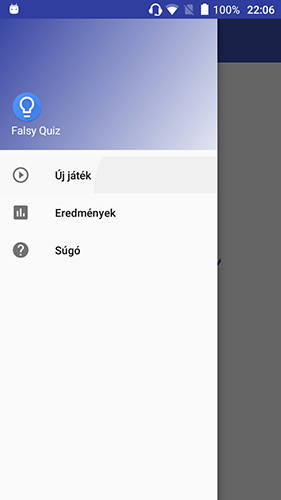
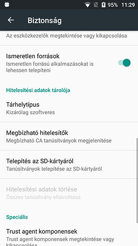

# FalsyQuiz

* [Bevezetés](README.md#Bevezetés)
* [Funkciók](README.md#Funkciók)
* [Platform](README.md#Platform)
* [Build](README.md#Build)
 * [Travis CI](#Travis CI)
* [Tesztek](README.md#Tesztek)
* [Fejlesztői eszközök](README.md#Fejlesztői eszközök)
  * [Lint](README.md#Lint)
  * [Javadoc](README.md#Javadoc)
* [Deploy](README.md#Deploy)
* [Telepítés](README.md#Telepítés)
* [Megjegyzés](README.md#Megjegyzés)
* [Ismert bug-ok](README.md#Ismert bug-ok)
* [Fejlesztők](README.md#Fejlesztők)

## [Bevezetés](#intro)

A projekt célja egy kvízjáték elkészítése Android rendszerre. A játék különlegessége abban áll, hogy nem hagyományos kérdés-válasz típusú kvíz lesz, habár így fog kinézni. Amint azt a projekt neve is mutatja, kissé becsapós lesz a játék, minden egyes rossz válasz esetén, illetve esetenként még a válaszadás előtt a játékos dolgát megnehezítendő, trükkös csapdákat helyezünk el a telefon képességeit kihasználva (például mozgás érzékelésére megváltozik a válaszok sorrendje, rossz válasz esetén a telefon elkezd sípolni).

## [Funkciók](#features)

A program indításakor rövid üdvözlőképernyő után a főmenübe jutunk. A menü a állapotsorban lévő ikonnal hozható elő. Az Új játékra való kattintás után elindul a játék, megjelenik az első kérdés 4 válaszlehetőséggel, melyek közül pontosan egy helyes. A kérdés megválaszolására 18 és 30 mp között véletlenszerűen kiválasztott idő áll rendelkezésre, ha nem sikerül adott időn be,ül helyesen megválaszolni a kérdést, akkor a játékos életet veszít. Helyes válasz esetén, illetve ha a játékosnak van még élete, akkor új kérdést kap, egészen addig amíg az összes kérdés el nem fogy, ekkor megnyerte a játékot. Ha a játkos életei elfogynak, akkor a kátéknak vége. Játék közben az alkalmazás különféle "akciókkal" próbálja megzavarni a kérdés megválaszolását (zajok, válaszok eltüntetése). Játék során 2+1 segítségre van lehetőség. Egy felezés ami 2 válaszlehetőséget elvesz, a telefonos segítség a helyes választ igyekszik megmutatni, egy Meglepetés segítség pedig véletlenszerűen vagy segít vagy nehezít. A segítségek a képernyő tetején lévő gombok segítségével aktiválhatóak.
Az eredmények fülön az eddigi játékok és azok eredményei találhatóak meg.

## [Platform](#platform)

Az alkalmazás által támogatott Android verziók:
* Android 5.1 - Lollipop (API level 22)
* Android 6.0 - Marshmallow (API level 23)
* Android 7.0, 7.1 - Nougat (API level 24, 25)
* Android 8.0 - Oreo (API level 26)

## [Build](#build)

Az alkalmazás buildeléséhez legalább **API level 23 Android sdk** és **Java SE 8 JDK** szükséges. A szükséges konfigurációk az **[app/build.gradle](app/build.gradle)** fájlban találhatóak. A build előtt **Windows** operációs rendszer esetén szükséges egy saját környezeti változó létrehozása **JAVA_HOME** néven, értéke pedig a Java 8 JDK bináris könyvtárának elérési útvonala.

A szükséges beállítások elvégzése után Windows operációs rendszer esetén az [auto_deploy_win.ps1](auto_deploy_win.ps1), Linux és Mac operációs rendszer esetén az [auto_deploy_linux.sh](auto_deploy_linux.sh) script használható. A build-elt alkalmazás a **FalsyQuiz\app\build\outputs\apk\debug\app-debug.apk** útvonalon érhető el.

Az alkalmazás build-eléséhez az [Android Studio 3.1](https://developer.android.com/studio/)-t ajánljuk!

### [Travis CI](#travis)

Jelen repository minden változása (push, pull request) esetén elindul egy automatizált build a Travis CI rendszer segítségével. Az eredmények megtekinthetőek itt: [https://travis-ci.org/FalsyQuiz/FalsyQuiz](https://travis-ci.org/FalsyQuiz/FalsyQuiz), illetve a jelen fájl tetején lévő build ikonra kattintva. A Travis CI instrumentális teszteket is futtat amihez emulátort használ, így a build ideje hozzávetőlegesen 10-12 perc. A részletes beállítások a [.travis.yml](.travis.yml) konfigurációs fájlban találhatóak.

## [Tesztek](#test)

A Unit tesztekhez JUnit keretrendszert a tesztekhez szükséges mock-ok elkészítséhez [Mockitot](https://developer.android.com/training/testing/unit-testing/local-unit-tests) használunk, a tesztek eredménye html formában is megtekinthető az alábbi mappában: **FalsyQuiz\reports**. A build-hez használ script-ek automatikusan futtatják a teszteket és exportálják az eredményt. A teszrendszer konfigurációja megtalálható az **[app/build.gradle](app/build.gradle)** fájl **testOptions** pontaj alatt, az eredmény a build scriptek futtatásakor a standard kimeneten is megjelenik.
**Az alkalmazás tesztelése még folyamatban van!**

## [Fejlesztői eszközök](#devTools)

### [Lint](#lint)

A forrásfájlok elemzéséhez és az esetleges hibás kiszűrésére [Lint](http://tools.android.com/tips/lint)-et használunk, a konfiguráció az [app/build.gradle](app/build.gradle) fájl **lintOptions** pontja alatt található. Az eredmények a build scriptek futtatása után a **FalsyQuiz\app\build\reports\lint-results.html** helyen találhatóak.

### [Javadoc](#javadoc)

Az használt osztályok és metódusok dokumentációja a **FalsyQuiz/javadoc** mappában html formában találhatóak. A build scriptek automatikusan újragenerálják a dokumentumokat. A főoldal az **index.html** fáj.
**A dokumentálás még folyamatban van!**

## [Deploy](#deploy)

A build-elt alkalmazás közzététele automatikusan megtörténi a build scriptek segítségével, a telepíthető alkalmazás az alábbi helyen érhető el [vadaszfoto.hu/FalsyQuiz/](http://vadaszfoto.hu/FalsyQuiz/). A közzétételhez szükséges kulcsok a projektmappában találhatóak:
[key.ppk](key.ppk), [key_linux.ppk](key.ppk). A közzétételt a **Travis CI** automatizáltan elvégzi minden sikeres build végén.

## [Telepítés](#install)

Az alkalmazás a build-elt apk-t a megadott platformra letöltve telepíthető. A telepítéshez emulátor is használható, de mindenképpen engedélyezni kell az Ismeretlen forrásokból való telepítést a Beállítások menü Biztonság füle alatt, lásd az alábbi képet. A szükséges engedélyek megadása után az apk fájl kiválasztásával a Telepítés lehetőségre kattintva automatikusan elindul a telepítés és az alkalmazás az eszköz kapacitásától függően néhány másodperc alatt kész a használatra.

## [Megjegyzés](#notification)

Az alkalmazás fejlesztése jelenleg folyamatban van, az éppen futó issue-k a projekt [issue board](https://github.com/FalsyQuiz/FalsyQuiz/projects/1)-ján találhatóak. A sugó funkció fejlesztése folyamatban van, az Eredmények részlegesen van megvalósítva.

## [Ismert bug-ok](#bugs)

Bizonyos esetekben a játék kétszer indul el, ezt duplikált időzítők által generált hanghatások és akciók formájában lehet észrevenni. A bug javítása folyamatban van.

## [Fejlesztők](#developers)

* Gecse Viktória
* Kiss Dávid
* Szalai Norbert
* Tóth Bálint
* Vadász Péter

(ELTE @IK, 2018 - Projekt Eszközök)
